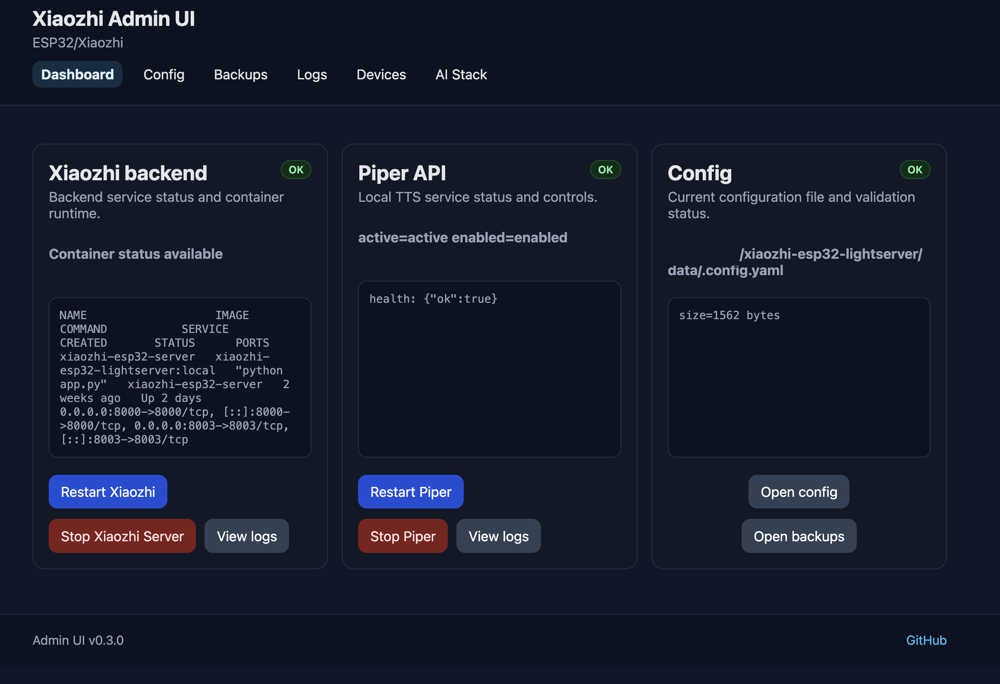

# Xiaozhi ESP32 Lightserver + Admin UI

[](https://github.com/cerocca/xiaozhi-esp32-lightserver)
[](https://github.com/cerocca/xiaozhi-esp32-lightserver)
[](https://github.com/cerocca/xiaozhi-esp32-lightserver/tree/main/admin-ui)
[](LICENSE)

Deployment-focused monorepo for a Xiaozhi-compatible ESP32 voice backend and its companion Admin UI.

Upstream server base:

- [xinnan-tech/xiaozhi-esp32-server](https://github.com/xinnan-tech/xiaozhi-esp32-server)

This repository combines:

- `server/` for the Xiaozhi backend runtime
- `admin-ui/` for the operator-facing web UI
- `data/.config.yaml` for the shared runtime configuration

The Admin UI is now the runtime control plane for the stack. It is used to inspect status, edit config, switch runtime profiles, and run isolated LLM, TTS, and ASR checks without automatically restarting services.

## Quick Navigation

- [Quick Start](#quick-start)
- [Admin UI](#admin-ui)
- [Backend Endpoints](#backend-endpoints)
- [Runtime Control Plane](#runtime-control-plane)
- [Docker Notes](#docker-notes)
- [Project Structure](#project-structure)
- [More Docs](#more-docs)

## Quick Start

```bash
git clone https://github.com/cerocca/xiaozhi-esp32-lightserver.git
cd xiaozhi-esp32-lightserver

cp .env.example .env
cp data/.config.example.yaml data/.config.yaml

# edit .env
# edit data/.config.yaml

docker compose up -d
```

Quick verification:

```bash
curl http://127.0.0.1:8000/
curl http://127.0.0.1:8003/api/health
```

Expected:

- port `8000` returns `Server is running`
- port `8003` returns JSON health data

## Admin UI

The Admin UI lives under `admin-ui/` and is run separately from the backend container stack.

Default access URL:

```text
http://<server-ip>:8088
```

What the Admin UI covers:

- config editing
- runtime profiles for LLM / ASR / TTS
- health and status visibility
- LLM runtime test with prompt and response preview
- TTS runtime test with text input and inline audio playback
- ASR runtime test with audio upload and transcription preview
- post-restart health snapshot
- logs, backups, and device visibility

Minimal startup:

```bash
cd admin-ui
python3 -m venv .venv
source .venv/bin/activate
pip install -r requirements.txt
cp .env.example .env
uvicorn app.main:app --host 0.0.0.0 --port 8088
```

Recommended monorepo `.env` values:

```env
XIAOZHI_DIR=..
XIAOZHI_CONFIG=../data/.config.yaml
```

See [`admin-ui/README.md`](admin-ui/README.md) and [`admin-ui/SETUP.md`](admin-ui/SETUP.md) for the full UI setup flow.

## Backend Endpoints

Main endpoints used by devices and the Admin UI:

- WebSocket: `ws://<server-ip>:8000/xiaozhi/v1/`
- Health API: `http://<server-ip>:8003/api/health`
- OTA base: `http://<server-ip>:8003/xiaozhi/ota/`

Important:

- use port `8000` for device WebSocket traffic
- use port `8003` for `/api/health`
- keep `.env` and `data/.config.yaml` aligned manually

Example config:

```yaml
server:
  websocket: ws://192.168.1.50:8000/xiaozhi/v1/
  vision_explain: http://192.168.1.50:8003/mcp/vision/explain

runtime:
  llm_profile: openai_llm
  asr_profile: openai_asr
  tts_profile: openai_tts
```

## Runtime Control Plane

The Admin UI is intended for practical runtime operations, not just static configuration pages.

Current capabilities:

- edit the shared backend YAML config
- inspect runtime health from `/api/health`
- review clearer dashboard and module status cards
- switch active runtime profiles for LLM, ASR, and TTS
- test LLM requests and inspect the response preview
- test TTS output and play audio inline
- test ASR with uploaded audio and preview the transcription
- review restart outcome via a post-restart health snapshot

Tests are isolated actions. They do not automatically restart services.

## Demo / Screenshots

The Admin UI can validate the runtime stack directly from the browser with isolated checks for LLM, TTS, and ASR.

**What you can test:**

- LLM: prompt → response preview  
- TTS: text → audio playback  
- ASR: audio upload → transcription preview  



_Screenshot files are optional and can be added under `docs/images/`._

## Docker Notes

The default `docker compose` flow packages the backend runtime only.

What that means:

- the image contains the server code from this repository
- runtime data stays under `./data`
- live config stays in `data/.config.yaml`
- local model or voice assets remain host-provided when your profile needs them
- remote/API-based providers still require valid URLs, credentials, and model names
- `admin-ui/` is not part of the default backend container packaging

Useful commands:

```bash
docker compose build
docker compose up -d
docker compose ps
docker compose logs --tail=100
```

## Project Structure

```text
.
├── admin-ui/                  # Admin UI runtime control plane
├── data/                      # shared runtime config and state
│   ├── .config.example.yaml
│   └── .config.yaml
├── models/                    # optional host-provided local assets
├── server/                    # backend/runtime area
│   └── main/xiaozhi-server
├── Dockerfile
├── docker-compose.yml
├── README.md
└── SETUP.md
```

## More Docs

- [`SETUP.md`](SETUP.md) for backend deployment and monorepo setup
- [`admin-ui/README.md`](admin-ui/README.md) for the Admin UI overview
- [`admin-ui/SETUP.md`](admin-ui/SETUP.md) for step-by-step Admin UI installation
- [`TODO.md`](TODO.md) for current roadmap notes
